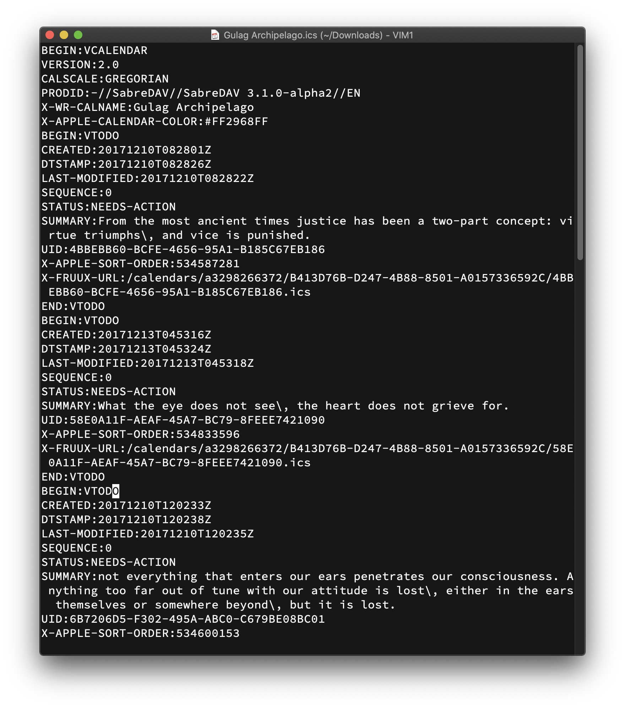

## Problem this solves

I use Fruux (fruux.com) as the backend to my iOS Reminders app.
Rather than for actual reminders, I used it for general notes, roughly one Reminders entry to a paragraph of notes.

Later I decided to switch to using the actual iOS Notes app, with my email provider (fastmail.fm) as the backend.
I trust Fastmail more than Fruux, and for me plain text (paragraphs) is a better long-term format for my notes than Reminders.

But how to transfer my existing data?

Fruux lets me download each set of Reminders (they call it Tasks) as an .ics file.  It looks like this:

This project converts the exported .ics file into the plaintext I want:

## How to run

    ./extract-summaries.awk downloaded-reminders-file.ics | sort | sed -E "s/^[[:digit:]]+ //" | awk '{ print $0 "\n" }'

## How does it work?

The key component is the venerable [AWK](https://en.wikipedia.org/wiki/AWK) and
[the AWK state machine parser pattern](https://two-wrongs.com/awk-state-machine-parser-pattern.html).

First, with AWK, I extract the content of each "reminder" (which will become the plaintext paragraph) and a sort order value.
The latter is needed because the order of the content in the ICS file does not always match the user-facing order.
The AWK script's output is the order value, space, then the plaintext content, one line per "reminder".

Second, I sort the output.
Since each line begins with the order value, we end up with "reminders" sorted by user-visible order.

Finally, after everything is extracted and sorted, we remove the sort order values and insert an additional linebreak between each line to separate paragraphs.

The biggest challenge I experienced is with `sed`'s differences between platforms.
I developed and tested this project only on macOS 10.15.

## Contributing

Contributions are welcome.  Viva la plaintext!
